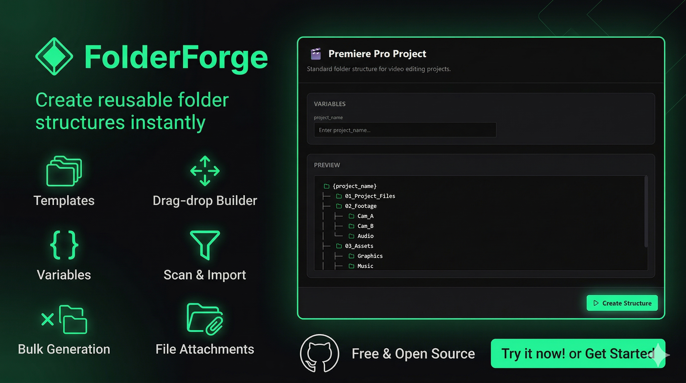

<div align="center">



<br />

[](LICENSE)
[](https://github.com/CyberWasDreaming0/folderforge/releases)
[](https://www.electronjs.org/)
[](https://react.dev/)


**Create beautiful folder structures instantly.**

[Download](#-download) · [Features](#-features) · [Development](#-development) · [Contributing](CONTRIBUTING.md)

</div>


## ✨ Features

- **🎨 Pre-Built Templates** — Ready-made folder structures for Premiere Pro, Unity, Software Dev, Freelance projects, and more
- **🛠️ Template Builder** — Visual drag-and-drop tree editor to create your own custom templates
- **🔄 Variable Substitution** — Use `{project_name}`, `{date}`, `{year}` and custom variables in folder names
- **📦 Bulk Generation** — Create numbered sequences with `{1..10}` or named sets with `{Mon,Tue,Wed}`
- **📂 Scan to Template** — Scan any existing folder on your computer and convert it into a reusable template
- **📎 File Copying** — Attach real files from your disk to templates; they're copied on creation
- **✅ Optional Nodes** — Toggle folders on/off before generating a structure
- **↩️ Undo / Redo** — Full undo/redo stack in the template builder with `Ctrl+Z` / `Ctrl+Y`
- **🔍 Template Search** — Quickly filter and find templates from your collection
- **🕑 Creation History** — Track every structure you've ever created
- **🌙 Dark Theme** — Beautiful, dark-first UI designed for productivity

---

## 📥 Download

> **Windows** — [Download the latest installer from Releases →](https://github.com/CyberWasDreaming0/folderforge/releases)

1. Go to the [Releases](https://github.com/CyberWasDreaming0/folderforge/releases) page
2. Download `FolderForge-Setup.exe`
3. Run the installer and you're ready to go!

---

## 🚀 Development

### Prerequisites

- [Node.js](https://nodejs.org/) 18+
- [npm](https://www.npmjs.com/) 9+

### Setup

```bash
# Clone the repository
git clone https://github.com/CyberWasDreaming0/folderforge.git
cd folderforge

# Install dependencies
npm install

# Start the development server (React + Vite)
npm run dev

# In another terminal, start Electron
npm run electron:dev
```

### Build

```bash
# Build the production bundle and Windows installer/portable
npm run electron:build
```

The installer will be generated in `dist-installer/` and the portable version in `dist-packager/`.

---

## 🏗️ Tech Stack

| Layer | Technology |
|---|---|
| **Frontend** | React 19, TypeScript, Tailwind CSS 4 |
| **Desktop** | Electron 35 |
| **Build** | Vite 6, @electron/packager |
| **Icons** | Lucide React |

---

## 🤝 Contributing

Contributions are welcome! Please read the [Contributing Guide](CONTRIBUTING.md) before submitting a Pull Request.

1. Fork the repository
2. Create your feature branch (`git checkout -b feature/amazing-feature`)
3. Commit your changes (`git commit -m 'Add amazing feature'`)
4. Push to the branch (`git push origin feature/amazing-feature`)
5. Open a Pull Request

---

## 📄 License

This project is licensed under the MIT License — see the [LICENSE](LICENSE) file for details.

---

<div align="center">
<sub>Thank You</sub>
</div>
